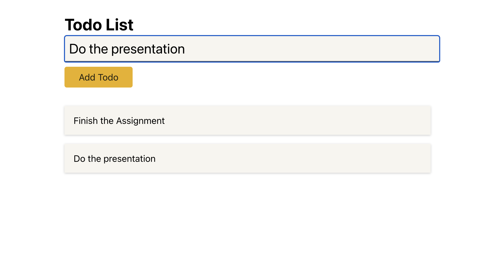

# Basic ToDo List with TypeScript

## What is this project?

- This is a basic and simple ToDo List web app
- Users can input their ToDo item and show them on the screen
- Users can also click each item to delete it

## How to Run this project?

- Download the project folder in your local machine
- Run `npm install` to install all the node packages
- Then run `npm start` to run the project