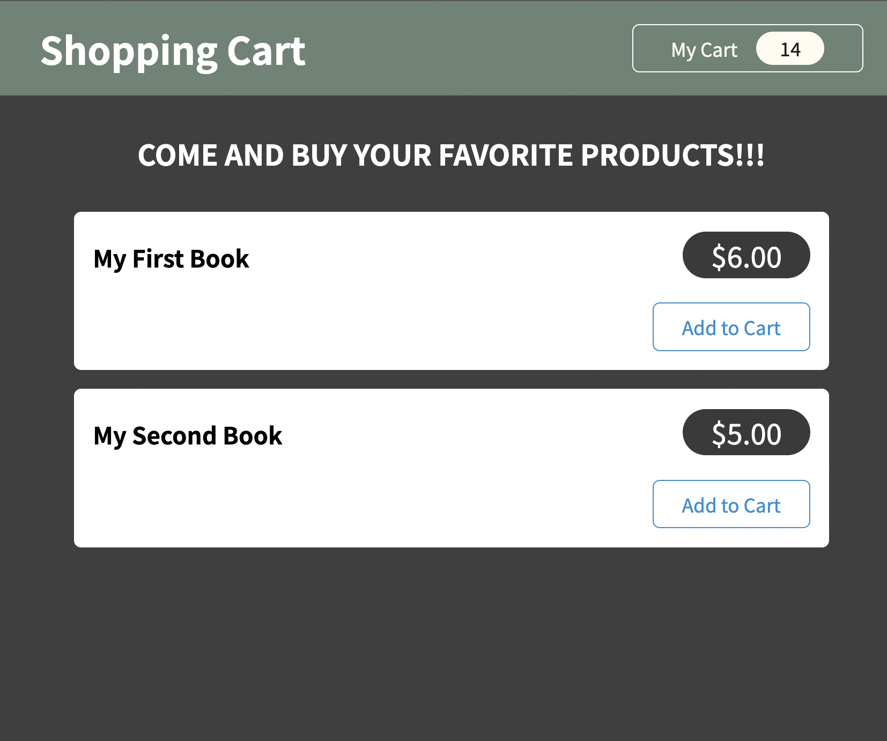
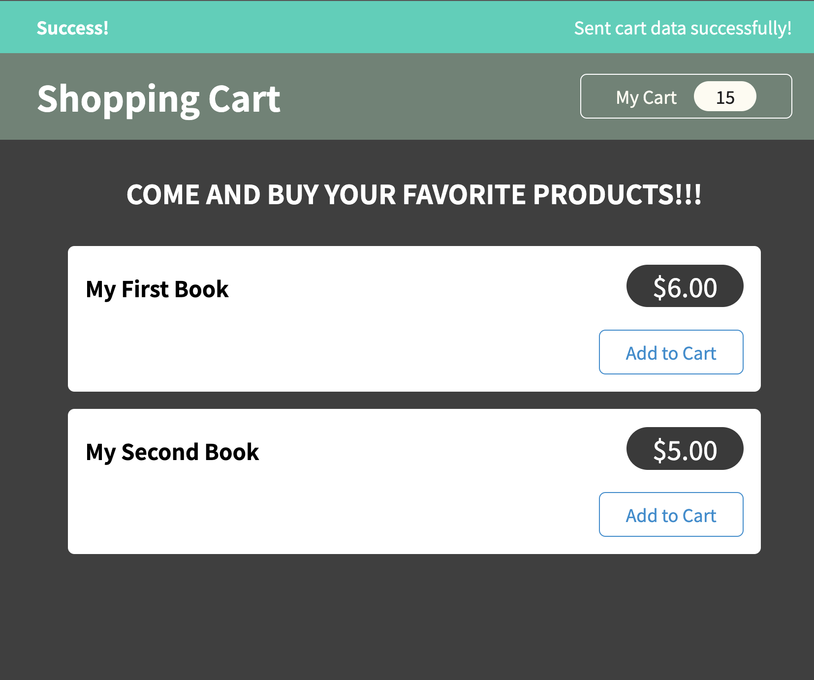
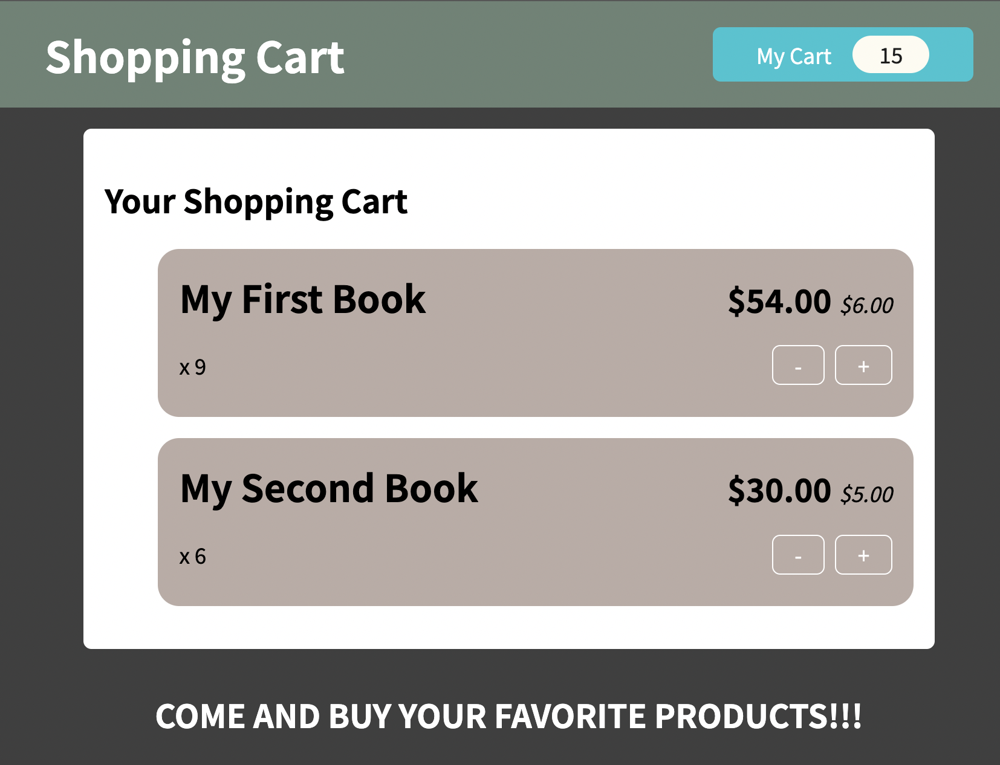

# Shopping Cart with Redux and Http Request

## What is this project?

- This is a shopping cart with Redux managing the states and HTTP requests
- Users can add item to their shopping cart, the data will be POST to your Firebase real-time-database
- Users can click the "My Cart" to open the shopping cart and change the amount of buying items
- When users reload the page, the shopping cart will automatically GET the data from the Firebase real-time-database

## How to Run this project?

- Download the project folder and run `npm install` to install all the packages
- Set up the HTTP backend
  - Create an account and a project on the [Firebase](https://firebase.google.com/)
  - Then create a "read-time-database" under your firebase project 
  - Change yoru "real-time-database" URL in the `cart-actions.js` file in the `store` folder
- Run `npm start`

