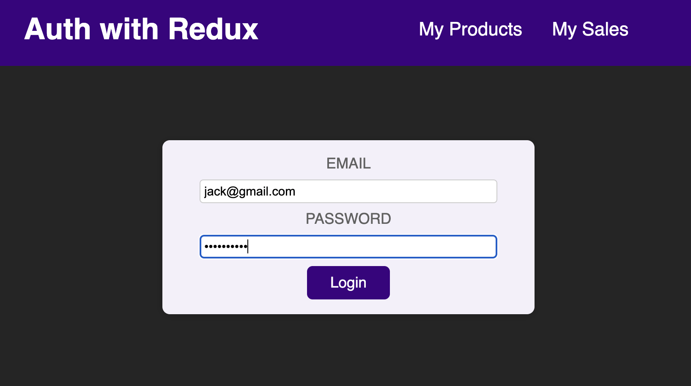
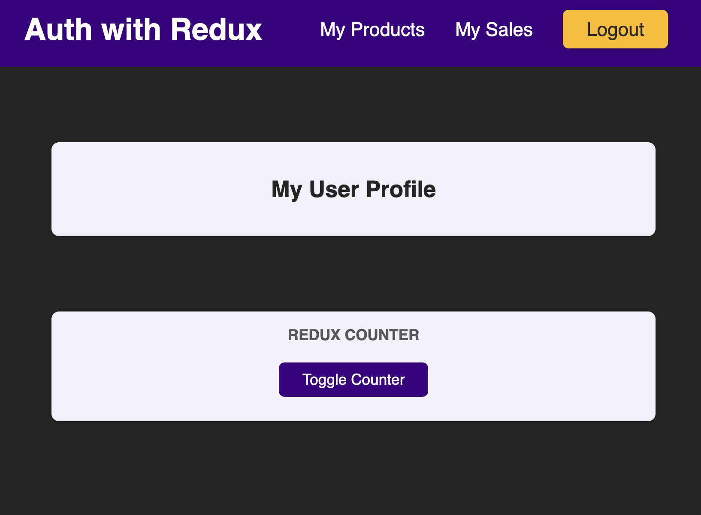
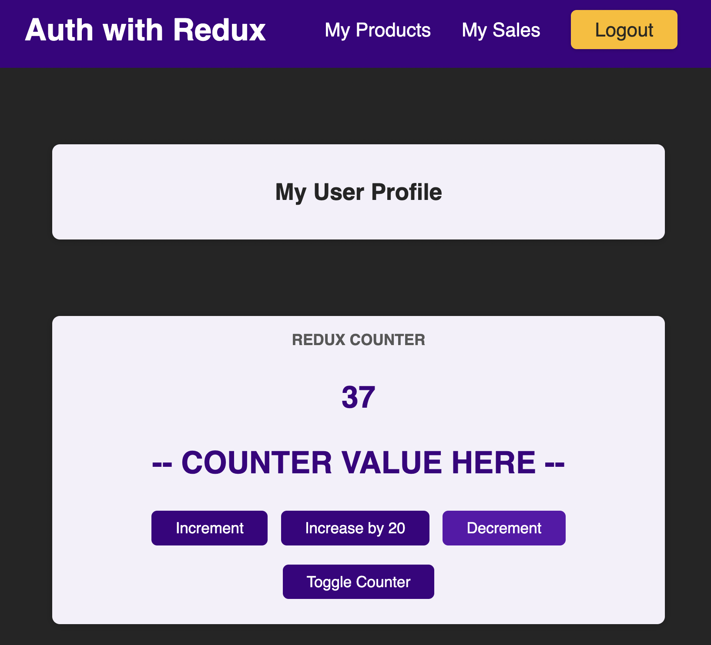

# Basic User Authentication & Counter with Redux

## What is this project?

- This is a demo web app with `Redux` managing all the complex states
- Users need to pass the email & password to login
  - `Email`: must have `@` and `.com`
  - `Password`:  must have 1 or more than 1 character
- After logging in, the header will show the `logout` button and user can click to log out
- Users can also then access the `Counter`, to increase / decrease numbers

## How to Run this project?

- Download the project folder
- Run `npm install` to install all the project packages
- Then run `npm start` to run the web app

<!-- 

 -->
