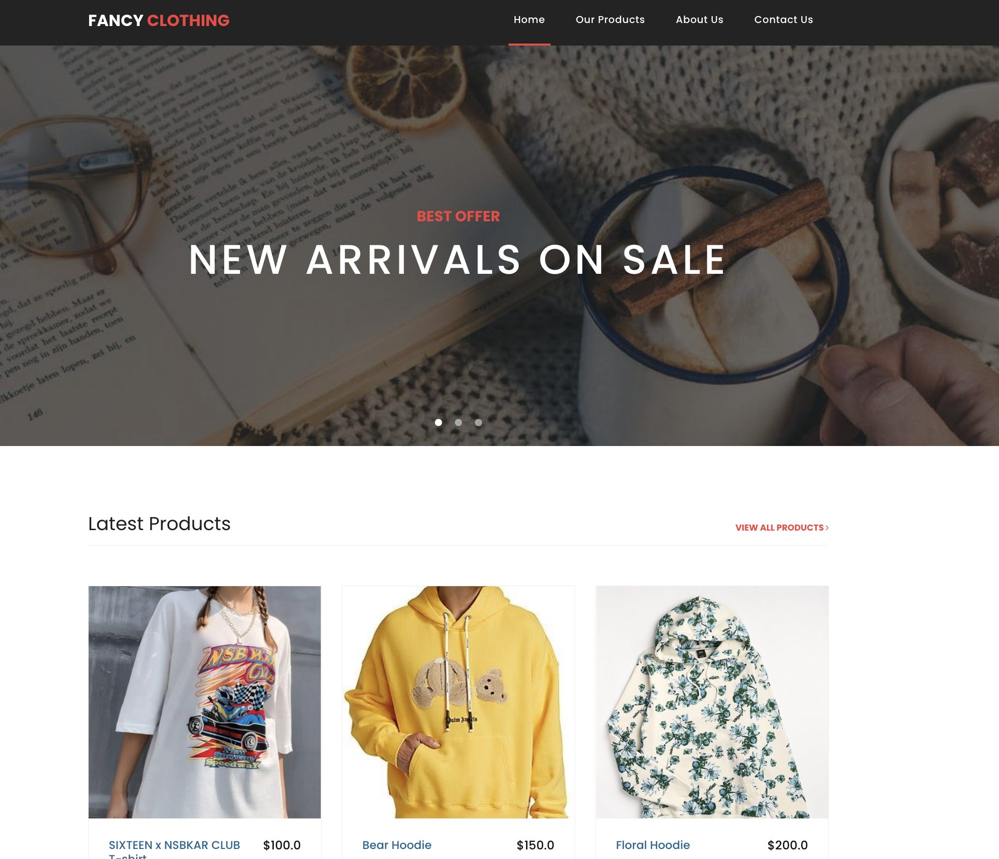
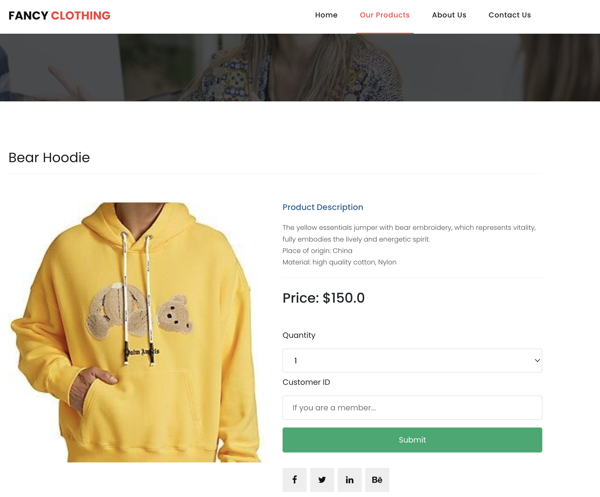
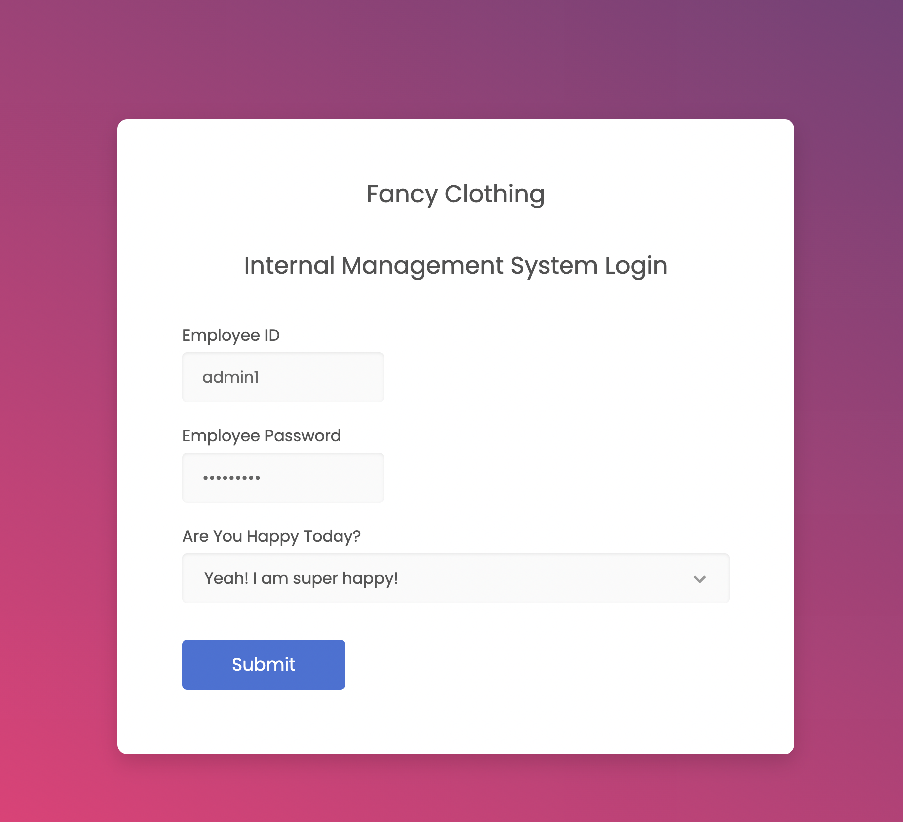
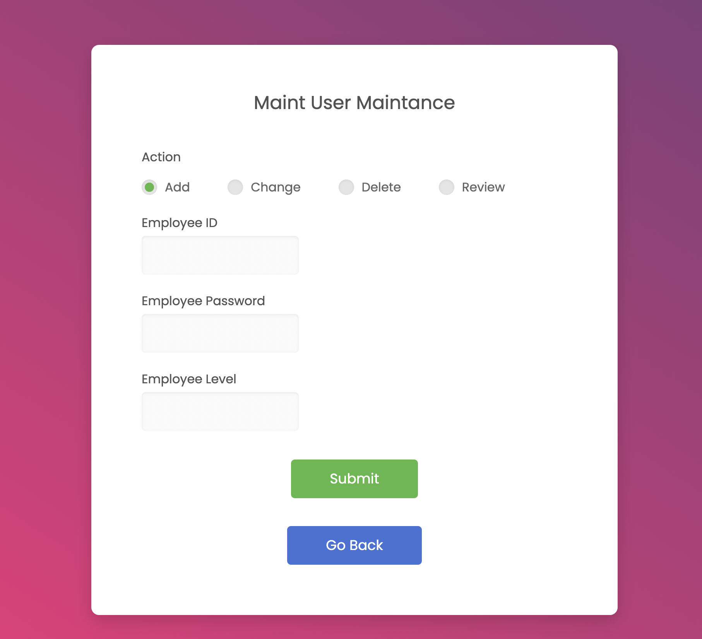
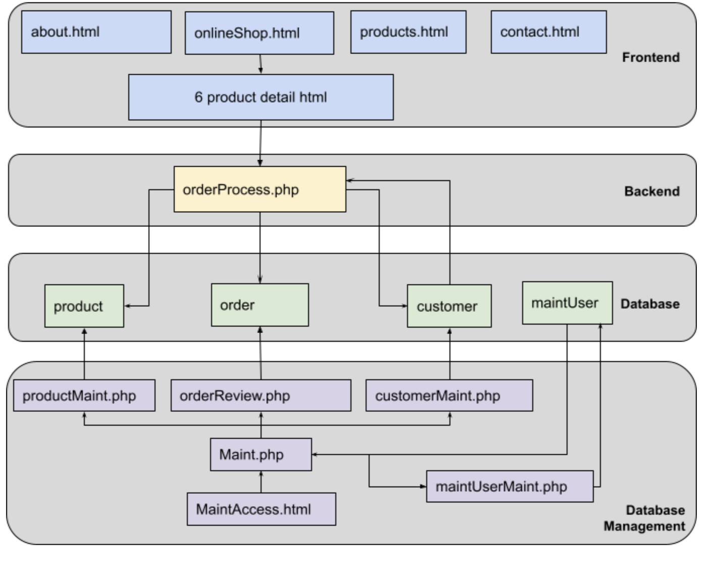

# Fancy Clothes Online Shop with Backend Management System

## How to Install?

This project is developed using [XAMPP](https://www.apachefriends.org/index.html), with HTML, CSS, JavaScript, PHP and MySQL.

If you simply want to use the online shop templates, you can simply download the folder and check with the `about`, `contact`,  `index`, `product` html files.

If you want to use the full version of the online shop and backend management system, please follow the following instructions (It has been created under Windows environment, not tested on MacOS yet, but it should work if you follow the XAMPP instructions.)

1. Download [XAMPP](https://www.apachefriends.org/index.html) with your operating system type
2. Open the installed folder, under `xampp` folder, find the `htdocs` folder
3. **Copy the whole `onlineShop` repository (folder) under the `htdocs` folder**
4. Up to this point, you should be able to finish the installation set up process

-----

## How to Play Around?

After finishing the installation process above, you can then follow the steps below each time you want to play with the online shop and management system by three steps below:

### Step1: Set Up the Database

1. Open a web browser (recommend Chrome), and input `http://127.0.0.1/onlineShop/DBStep1CreateDB.php` in the URL
2. Then input `http://127.0.0.1/onlineShop/DBStep2CreateTable.php`
3. Then input `http://127.0.0.1/onlineShop/DBStep3InsertRecord.php`

### Step2: Access the Internal Management System

4. Then input the URL `http://127.0.0.1/onlineShop/MaintAccess.html` to access the internal management system
5. Input the following Employee ID & Password to login the internal management system

|                  | Employee ID | Employee Password | Access                       |
| ---------------- | ----------- | ----------------- | ---------------------------- |
| Level 1 employee | admin1      | password1         | can maint maintuser table    |
| Level 2 employee | admin2      | password2         | cannot maint maintuser table |

### Step3: Access the Online Shop

6.  Input URL: `http://127.0.0.1/onlineShop/MaintAccess.html` to access the shopping page, and click all button to purchase

----

## Project Outlook

The Online Shop looks like below

And the Internal Management System looks like below:

---

## Project Key Features

As an online shop system, it has the full frontend and backend services:

- Users can go through the web pages and click to find different sections of the online shop, including home page, product pages, About Us, Contact Us, etc. It also includes nice visuals and interactive elements
- Users can click to the detailed product pages and direcly place orders
- The orders will be recorded and price will be calculated together, and sent to the edatabase behind the scene
- By accessing the internal management system, internal staffs can easily check how many orders have been placed, maintain customers, employees, including the access to use internal management system, etc.

----

## For Developers

The project architecture design is as follow:

It is a pity that all files are stored directly in the root of the repository, instead of in a cleaner format, due to time limit of this project. If you are interested, feel free to help clean the files in a cleaner component format.

Also, you can use the XAMPP functions to access the MySQL directly, by clicking `Admin` button on the XAMPP Control Panel, where you start the `MySQL` in the beginning. 

---

## Special Thanks

This is a student's project done within one month, it cannot make it without the help with all team members's effort and professor's help.

Also thanks to [Free-CSS Website](https://www.free-css.com/) for sharing the CSS templates and JS functions used in this project.

