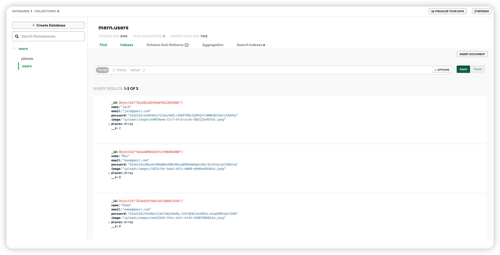

# Sharing Favourite Location App

## What is this project?

- This is a web app with full-stack from frontend to backend to database
- This app allows users to create accounts and share their favourite locations with uploaded pictures
- Users can see others' locations and upload & modify their own locations

## Special Remarks About Projects

## How to Run this project?

- Download the project folder and run `npm install` in both frontend and backend folder
- Change the `Google API KEY` in both frontend & backend, also change the `MongoDB Database` in the backend
- Run `npm start` on both frontend & backend to start the projects

## User Journey & Detailed App Description

- Users can sign up with their email, password and upload their profile images

  - User information Validation check has been done on both frontend & backend

    

  - User account has been created on the backend side, the password has been tokenised for security issue

    

  - Users can also login if they have already created the account before

    

    

- After signing up / logging in, users will be directly to the home page

  - Random users without signup can also go to home page and check others' locations, however, they have no certain specific pages on navigation bar nor editing access

  - Users without login / signup

    

  - Users with login / signup

    

    

- Users can also click any user to see their places

  - Users have no access to edit others' locations

    

  - Users can also click `view on map` to check the location (done with `Google Map API`)

    

  

- Users can then also add their own places

  - Users can fill in places information and upload images

    

  - Users will then be directed to home page and they can see their profile with one more places

    

  - Users can also then check the detailed of their places, here they have the access to edit and delete the place

    

  - And check the location on map, this is using the Google Geocoding API on the backend to find the coordinates based on the location address

    

  - Users can also edit their created location

    

  - And the information will all be stored and updated on the Database

    

  